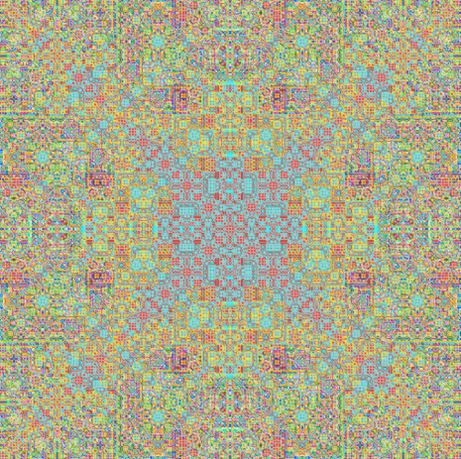
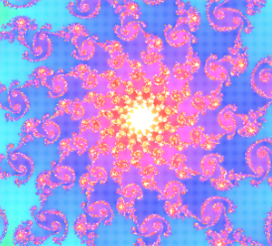
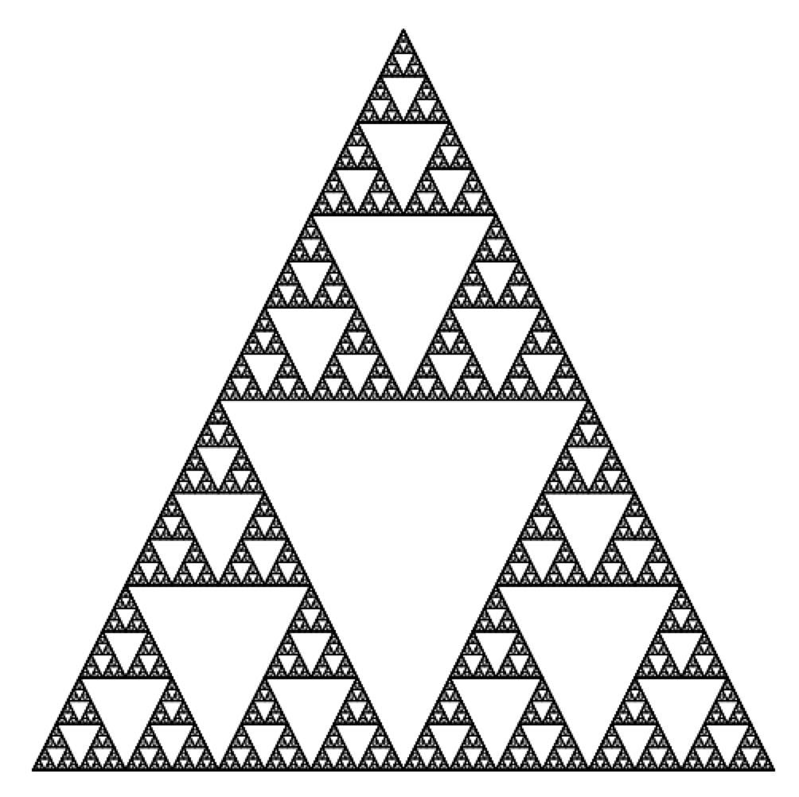

These are some programs I made in 2013 that output some art-like pictures

	Some examples include:
 

These are just some of my favorite outputs

BouncingBalls produces just that, and flower produces a flower like image with many colors

